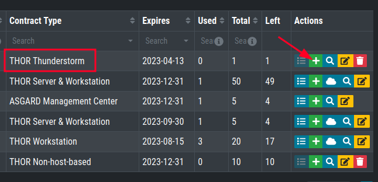

Install Thunderstorm Service
============================

Get a Service License
---------------------

To run THOR in Thunderstorm service mode, you need a license of a
special type named ``THOR Thunderstorm`` which allows this mode of operation.

   Thunderstorm License Type in Customer Portal

Download Thunderstorm Installer Script
--------------------------------------

Use the Thunderstorm installer script ``thunderstorm-installer.sh`` for
Linux systems published in our Github repository:

https://github.com/NextronSystems/nextron-helper-scripts/tree/master/thunderstorm

Install Required Packages
-------------------------

The Installer script requires the tools ``wget`` and ``unzip``. To see
if those tools are installed, run the following command:

.. code-block:: console

   user@unix:~$ which wget unzip
   /usr/bin/wget
   /usr/bin/unzip

If the output is empty or missing one of the tools, you can install
the missing tools on your Linux system with one of the following commands:

.. code-block:: console 

   user@unix:~$ sudo apt install wget unzip 

.. code-block:: console 

   user@unix:~$ sudo yum install wget unzip 

.. code-block:: console 
   
   user@unix:~$ sudo zypper install wget unzip

Run Thunderstorm Installer Script
---------------------------------

Make sure that the license file is in the current working directory
together with the thunderstorm-installer.sh and run the following
commands:

.. code-block:: console

   user@unix:~$ chmod +x thunderstorm-installer.sh

The script will show you the changes that it's going to make and asks
for a confirmation.

.. code-block:: console

   user@unix:~$ sudo ./thunderstorm-installer.sh 
   [sudo] password for user: 
   ==============================================================
      ________                __            __                
      /_  __/ /  __ _____  ___/ /__ _______ / /____  ______ _  
      / / / _ \/ // / _ \/ _  / -_) __(_-</ __/ _ \/ __/  ' \ 
     /_/ /_//_/\_,_/_//_/\_,_/\__/_/ /___/\__/\___/_/ /_/_/_/ 
     v0.4.1
 
     THOR Thunderstorm Service Installer
     Florian Roth, August 2022
   ==============================================================

   The script will make the following changes to your system:
   1. Install THOR into /opt/nextron/thunderstorm
   2. Drops a base configuration into /etc/thunderstorm
   3. Create a log directory /var/log/thunderstorm for log files of the service
   4. Create a user named 'thunderstorm' for the new service
   5. Create a new service named 'thor-thunderstorm'

   You can uninstall THOR Thunderstorm with './thunderstorm-installer uninstall'

   Are you ready to install THOR Thunderstorm? (y/N)y
   Started Thunderstorm Installer - version 0.4.1 
   Writing logfile to ./Thunderstorm_Installer_unix_20230105.log 
   HOSTNAME: unix 
   IP: 192.168.0.110  
   OS: BUG_REPORT_URL="https://bugs.debian.org/";HOME_URL="https://www.debian.org/";ID=debian;NAME="Debian GNU/Linux";PRETTY_NAME="Debian GNU/Linux 10 (buster)";SUPPORT_URL="https://www.debian.org/support";VERSION="10 (buster)";VERSION_CODENAME=buster;VERSION_ID="10"; 
   ISSUE: Nextron Systems - ASGARD Management Center - \l 
   KERNEL: Linux unix 4.19.0-21-amd64 #1 SMP Debian 4.19.249-2 (2022-06-30) x86_64 GNU/Linux 
   Checking the required utilities ... 
   All required utilities found. 
   Searching for license file in current folder ... 

Debugging
---------

Most Common Problems
^^^^^^^^^^^^^^^^^^^^

* Wrong or expired license
* Port 8080 is already in use

Access the Web GUI
^^^^^^^^^^^^^^^^^^

Check the Web GUI on: :samp:`http://127.0.0.1:8080/`

Check the Log File
^^^^^^^^^^^^^^^^^^

.. code-block:: console

   user@unix:~$ sudo tail -100 /var/log/thunderstorm/thunderstorm.log

Start Service Manually
^^^^^^^^^^^^^^^^^^^^^^

.. code-block:: console

   user@unix:~$ sudo /opt/nextron/thunderstorm/thor-linux-64 --thunderstorm -t /etc/thunderstorm/thunderstorm.yml

Warning: in case of a successful service start, the log file will be
created readable for root user only, make sure to delete if afterwards.
An unwritable log file causes the service to fail.

.. code-block:: console
   
   user@unix:~$ sudo rm /var/log/thunderstorm/thunderstorm.log

Silent Installation
-------------------

In cases in which you do not want the installer to prompt you for a
confirmation (e.g. Docker installation), use the ``auto`` parameter.

.. code-block:: console
   
   user@unix:~$ sudo ./thunderstorm-installer.sh auto

Uninstall Thunderstorm
----------------------

You can always uninstall THOR Thunderstorm with

.. code-block:: console
   
   user@unix:~$ sudo ./thunderstorm-installer.sh uninstall

The only files that are left on a system are the log files in
``/var/log/thunderstorm``.
