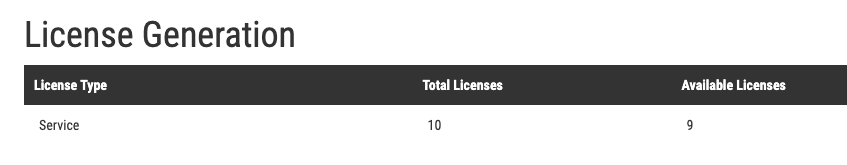

Install Thunderstorm Service
============================

Get a Service License
---------------------

To run THOR in Thunderstorm service mode, you need a license of a
special type named „Service” license that allows this mode of operation.

   Service License Type in Customer Portal

Download Thunderstorm Installer Script
--------------------------------------

Use the Thunderstorm installer script **thunderstorm-installer.sh** for
Linux systems published in our Github repository:

https://github.com/NextronSystems/nextron-helper-scripts/tree/master/thunderstorm

Install Required Packages
-------------------------

The Installer script requires the tools **wget** and **unzip**. Install
these tools on your Linux server system with:

.. code:: bash 

   sudo apt install wget unzip 

   sudo yum install wget unzip 

   sudo zypper install wget unzip

Run Thunderstorm Installer Script
---------------------------------

Make sure that the license file is in the current working directory
together with the thunderstorm-installer.sh and run the following
commands:

.. code:: bash

   chmod +x thunderstorm-installer.sh 

The script will show you the changes that it’s going to make and asks
for a confirmation.

.. figure:: ../images/image4.png
   :target: ../_images/image4.png
   :alt: Thunderstorm Installer

   Thunderstorm Installer

Debugging
---------

Most Common Problems
^^^^^^^^^^^^^^^^^^^^

* Wrong or expired license
* Port 8080 is already in use

Access the Web GUI
^^^^^^^^^^^^^^^^^^

Check the Web GUI on: \ http://0.0.0.0:8080/

Check the Log File
^^^^^^^^^^^^^^^^^^

.. code:: bash

   sudo tail -100 /var/log/thunderstorm/thunderstorm.log

Start Service Manually
^^^^^^^^^^^^^^^^^^^^^^

.. code:: bash

   sudo /opt/nextron/thunderstorm/thor-linux-64 --thunderstorm -t /etc/thunderstorm/thunderstorm.yml

Warning: in case of a successful service start, the log file will be
created readable for root user only, make sure to delete if afterwards.
An unwritable log file causes the service to fail.

.. code:: bash
   
   sudo rm /var/log/thunderstorm/thunderstorm.log

Silent Installation
-------------------

In cases in which you do not want the installer to prompt you for a
confirmation (e.g. Docker installation), use the **auto** parameter.

.. code:: bash
   
   sudo ./thunderstorm-installer.sh auto

Uninstall Thunderstorm
----------------------

You can always uninstall THOR Thunderstorm with

.. code:: bash
   
   sudo ./thunderstorm-installer.sh uninstall

The only files that are left on a system are the log files in
/var/log/thunderstorm.
