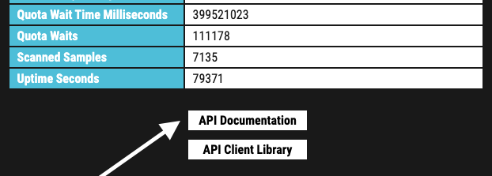

Next Steps
==========

After the installation you can test the service using one of the
Thunderstorm collectors or the Python API client.

Configuration
-------------

The installation script for Linux system installs a service that passes
the parameter **-t /etc/thunderstorm/thunderstorm.yml** to initialize
the default config stored at that location.

The default configuration file on Linux looks like this:

+---------------------------------------------------------------------------------+
| # License path                                                                  |
|                                                                                 |
| license-path: /etc/thunderstorm                                                 |
|                                                                                 |
| # Write all outputs to the following directory                                  |
|                                                                                 |
| logfile: /var/log/thunderstorm/thunderstorm.log                                 |
|                                                                                 |
| appendlog: True                                                                 |
|                                                                                 |
| # Listen on all possible network interfaces                                     |
|                                                                                 |
| server-host: 0.0.0.0                                                            |
|                                                                                 |
| server-port: 8080                                                               |
|                                                                                 |
| # Pure YARA scanning                                                            |
|                                                                                 |
| pure-yara: False                                                                |
|                                                                                 |
|                                                                                 |
|                                                                                 |
| # SSL/TLS                                                                       |
|                                                                                 |
| # SSL/TLS Server Certificate                                                    |
|                                                                                 |
| #server-cert: /path/to/file                                                     |
|                                                                                 |
| # SSL/TLS Server Certificate Private Key                                        |
|                                                                                 |
| #server-key: /path/to/file                                                      |
|                                                                                 |
| # File Submissions                                                              |
|                                                                                 |
| # Directory to which the samples get stored in asynchronous mode                |
|                                                                                 |
| server-upload-dir: /tmp/thunderstorm                                            |
|                                                                                 |
| # Permanently store the submitted samples (valied values: none/all/malicious)   |
|                                                                                 |
| server-store-samples: none                                                      |
|                                                                                 |
|                                                                                 |
|                                                                                 |
| # Tuning                                                                        |
|                                                                                 |
| # Server Result Cache                                                           |
|                                                                                 |
| # This is the number of cached results from asynchronous submission             |
|                                                                                 |
| # available for remote queries (default: 10000)                                 |
|                                                                                 |
| #server-result-cache-size: 10000                                                |
+---------------------------------------------------------------------------------+

You can use all of THOR’s flags in that configuration. Be advised that
you always have to use their long form.

This page lists all of THOR command line flags:

https://github.com/NextronSystems/nextron-helper-scripts/tree/master/thor-help

The following chapters list some of the most useful command line flags
when using THOR Thunderstorm.

Forward Logs to SIEM or Analysis Cockpit
^^^^^^^^^^^^^^^^^^^^^^^^^^^^^^^^^^^^^^^^

+------------------+
| syslog:          |
|                  |
| - mysiem.local   |
+------------------+

Config entry to forward logs to a SIEM

We recommend reading chapter 10.2 Syslog or TCP/UDP Output in the `THOR User Manual <https://thor-manual.nextron-systems.com/en/latest/>`_ for
details on the SYSLOG forwarding flags. You can find it in the folder
/opt/nextron/thunderstorm/docs after a successful Thunderstorm
installation on Linux or in the “Downloads” section in the customer
portal.

Keep Samples on the Thunderstorm Server
~~~~~~~~~~~~~~~~~~~~~~~~~~~~~~~~~~~~~~~

+-----------------------------------+
| server-store-samples: malicious   |
+-----------------------------------+

Keep samples with findings

+-----------------------------+
| server-store-samples: all   |
+-----------------------------+

Keep all samples

Log Output
----------

The scan results and startup messages can be found in:

.. code:: bash
   
   /var/log/thunderstorm/thunderstorm.log

You could open another command line window and monitor new messages
with:

.. code:: bash
   
   tail -f /var/log/thunderstorm/thunderstorm.log

Thunderstorm API Documentation
------------------------------

An API documentation is integrated into the web service.

Simply visit the service URL, e.g.: http://my-server:8080/

   Thunderstorm API Documentation

Test Submission
---------------

To test the Thunderstorm service, you can create a tiny webshell sample
and submit it to the service using the following commands.

.. code:: bash
   
   echo "<%eval request(" > test.txt                                              
                                                                                 
   curl -X POST "http://0.0.0.0:8080/api/check?pretty=true" -F "file=@test.txt"    

This should produce the following output in the current command line.

.. code:: bash
   
   [
      {                                                                               
         "level": "Alert",
         "module": "Filescan", 
         "message": "Malware file found",      
         "score": 350, 
         "context": {                                                                
            "ext": ".txt", 
            "file": "test.txt",
            "firstBytes": "3c256576616c2072657175657374280a / \\u003c%eval request(\\n"
            "md5": "2481bc6bb2d063522ef8b5d579fd97d7",  
            "sha1": "4d40de75d7c8591d2ea59d3a000fb6cf58d97896",                                               
            "sha256": "3b435df5076f6b1df7f2bc97cd86fbf7b479352e8c33960dfc4f1cbbe9b14fa7",             
            "size": 16,                                            
            "type": "JSP" 
     },                                                                
 …                                                 

Output of test sample submission

Be aware that this has been a “synchronous” submission to the API
endpoint “check”. The collection of high amounts of samples in collector
scripts and tools uses the endpoint “checkAsync”, which doesn’t return a
result to the submitting source.

Test Submission Using the API Documentation
^^^^^^^^^^^^^^^^^^^^^^^^^^^^^^^^^^^^^^^^^^^

The web GUI running on Port 8080 contains an interactive API
documentation, which you can use to submit a first test sample.

   Link to API Documentation on Start Page

Select the API function /api/check, then click “Try it out” and then
select and submit a sample using the enabled form.

   Test Sample Submission via API Documentation

The result appears in a separate text field. Use the “pretty” flag to
get a prettified JSON response.

Thunderstorm Collectors
-----------------------

You can find a Thunderstorm collector for numerous different operating
systems and architecture in our Github repository.

https://github.com/NextronSystems/thunderstorm-collector

See the README on Github for more information.

Performance Considerations for the Collection
^^^^^^^^^^^^^^^^^^^^^^^^^^^^^^^^^^^^^^^^^^^^^

In a THOR Thunderstorm setup, the system load moves from the end systems
to the Thunderstorm server.

In cases in which you don’t use the default configuration file provided
with the collectors (**config.yml**) and collect all files from an end
system, the Thunderstorm server requires a much higher amount of time to
process the samples.

E.g. A Thunderstorm server with 40 CPU Cores (40 threads) needs 1 hour
to process all 400,000 files sent from a Windows 10 end system. Sending
all files from 200 Windows 10 end systems to a Thunderstorm server with
that specs would take up to 10 days to process all the samples.

As a rule of thumb, when using the hardware recommended in :ref:`chapter 1.2 "Hardware Requirements" <usage/requirements:Hardware Requirements>`, calculate with a processing speed of **250
samples per core per minute**.

We highly recommend using the default configuration file named
**config.yml** provided with the collectors. See the README on Github
for more information.

Thunderstorm API Client
-----------------------

We provide a free and open source command line client written in Python
to communicate with the Thunderstorm service.

https://github.com/NextronSystems/thunderstormAPI

It can be installed with:

.. code:: bash 
   
   pip install thunderstormAPI 

Source Identification
---------------------

The log file generated by THOR Thunderstorm doesn’t contain the current
host as hostname in each line. By default, it contains the sending
source’s FQDN or IP address if a name cannot be resolved using the
locally configured DNS server.

However, every source can set a “source” value in the request and
overwrite the automatically evaluated hostname. This way users can use
custom values that are evaluated or set on the sending on the end
system.

.. code:: bash
   
   curl -X POST "http://myserver:8080/api/check?source=test" -F "file=@sample.exe"

Synchronous and Asynchronous Mode
---------------------------------

It is also important to mention that THOR Thunderstorm supports two ways
to submit samples, a synchronous and an asynchronous mode.

The default is synchronous submission. In this mode, the sender waits
for the scan result, which can be empty in case of no detection or
contains match elements in cases in which a threat could be identified.

In asynchronous mode, the submitter doesn’t wait for the scan result but
always gets a send receipt with an id, which can just be discarded or
used to query the service at a later point in time. This mode is best
for use cases in which the submitter doesn’t need to know the scan
results and batch submission should be as fast as possible.

+------------------------------------+------------------------------------------+-----------------------------------------------+
|                                    | Synchronous                              | Asynchronous                                  |
+====================================+==========================================+===============================================+
| Server API Endpoint                | /api/check                               | /api/checkAsync                               |
+------------------------------------+------------------------------------------+-----------------------------------------------+
| | ThunderstormAPI 		     |						| --asyn					|
| | Client Parameter   		     |                                          |       	                                |
+------------------------------------+------------------------------------------+-----------------------------------------------+
| Advantage                          | Returns Scan Result                      | Faster Submission                             |
+------------------------------------+------------------------------------------+-----------------------------------------------+
| Disadvantage                       | Client waits for result of each sample   | | No immediate scan result 			|
|				     |						| | on the client side   			|
+------------------------------------+------------------------------------------+-----------------------------------------------+

In asynchronous mode, the Thunderstorm service keeps the samples in a
queue on disk and processes them one by one as soon as a thread has time
to scan them. The number of files in this queue can be queried at the
status endpoint **/api/status** and checked on the landing page of the
web GUI.

In environments in which the Thunderstorm service is used to handle
synchronous and asynchronous requests at the same time, it is possible
that all threads are busy processing cached asynchronous samples and not
more synchronous requests are possible.

In this case use the **--sync-only-threads** flag to reserve a number of
threads for synchronous requests. (e.g. **--threads 40
--sync-only-threads 10**)

Performance Tests
-----------------

Performance tests showed the differences between the two submission
modes.

In Synchronous mode, sample transmission and server processing take
exactly the same time since the client always waits for the scan result.
In asynchronous mode, the sample transmission takes much less time, but
the processing on the server takes a bit longer, since the sever caches
the samples on disk.

+-----------------------+---------------+----------------+
|                       | Synchronous   | Asynchronous   |
+=======================+===============+================+
| Client Transmission   | 40min         | 18min          |
+-----------------------+---------------+----------------+
| Server Processing     |               | 46min          |
+-----------------------+---------------+----------------+
| Total Time            | 40min         | 46min          |
+-----------------------+---------------+----------------+

SSL/TLS
-------

We do not recommend the use of SSL/TLS since it impacts the submission
performance. In cases in which you transfer files through networks with
IDS/IPS appliances, the submission in an SSL/TLS protected tunnel
prevents IDS alerts and connection resets by the IPS.

Depending on the average size of the samples, the submission frequency
and the number of different sources that submit samples, the
transmission could take up to twice as much time.

Note: The thunderstormAPI client doesn’t verify the server’s certificate
by default as in this special case, secrecy isn’t important. The main
goal of the SSL/TLS encryption is an obscured method to transport
potentially malicious samples over network segments that could be
monitored by IDS/IPS systems. You can activate certificate checks with
the **--verify** command line flag or **verify** parameter in API
library’s method respectively.

